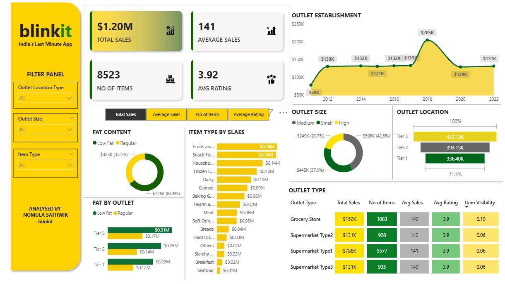

# Blinkit Sales and Outlet Performance Analysis (Power BI)

## Overview
This repository contains a Power BI dashboard that analyzes Blinkit’s sales performance, item mix, outlet characteristics, and customer rating metrics. The goal is to provide business stakeholders with a single view to monitor topline revenue, average sales, catalog breadth, ratings, and performance by outlet attributes (location tier, size, and type).

The dashboard is fully interactive with slicers for Outlet Location Type, Outlet Size, and Item Type, enabling deep-dive analysis and easy comparisons across segments.

## Key Metrics (KPIs)
- Total Sales
- Average Sales
- Number of Items
- Average Rating

## Dashboard Pages & Visuals
- Outlet Establishment Trend: Year-over-year sales line/area chart with markers.
- Fat Content Mix: Donut chart splitting Low Fat vs. Regular and their sales share.
- Item Type by Sales: Ranked bar chart of item categories contributing to sales.
- Fat by Outlet (Tier-wise): Horizontal bars comparing sales by Tier and fat content.
- Outlet Size Contribution: Donut chart showing sales share by Small, Medium, High.
- Outlet Location Performance: Tier 1/2/3 bar chart with contribution percentages.
- Outlet Type Summary Table: Matrix with Total Sales, No. of Items, Avg Sales, Avg Rating, and Item Visibility score.
- Filter Panel: Slicers for Outlet Location Type, Outlet Size, and Item Type.

## Files in this Repository
- `Blinkit-Analysis.pbix` — Power BI report file.
- `Blinkit-Dashboard.jpg` — Dashboard preview image.
- `data/` — Source dataset(s) in CSV format (if shareable).
- `README.md` — Project documentation (this file).

## Data Schema (typical fields)
- Date/Year, Item Type, Fat Content, Item Visibility
- Outlet Type, Outlet Size (Small/Medium/High), Outlet Location Type (Tier 1/2/3)
- Sales Amount, Number of Items, Average Rating

## How to Use
1. Download `Blinkit-Analysis.pbix`.
2. Open with Power BI Desktop (latest version recommended).
3. If prompted, update the data source path to the CSV files under `data/`.
4. Refresh the report.
5. Use slicers (left panel) to segment results by outlet attributes.

## Business Questions Answered
- Which outlet type (Grocery vs. Supermarket) contributes most to total sales?
- How do Tier 1, Tier 2, and Tier 3 locations compare in revenue and item visibility?
- Which item categories drive the highest sales?
- Does outlet size correlate with higher sales or ratings?
- What’s the sales split between Low Fat and Regular products?

## Insights Highlights (example)
- Supermarket Type1 drives the largest share of sales with strong visibility and breadth.
- Tier 3 locations contribute significantly, indicating growth potential beyond Tier 1.
- Low Fat vs. Regular mix reveals opportunities for product positioning and promotions.
- Medium/High outlet sizes show higher average sales, suggesting scale advantages.

## Assumptions & Notes
- Dataset is prepared and cleaned for reporting; missing values and outliers handled.
- Monetary values are aggregated to the report’s currency unit (e.g., $K).
- Item Visibility is a normalized score (0–1) representing shelf exposure/discoverability.

## Extending the Dashboard
- Add time granularity filters (month/quarter).
- Introduce profit margin and discount impact analysis.
- Build cohort analysis by outlet onboarding year.
- Create a “Top/Bottom 10 Items” page by sales and rating.

## Screenshots

## Tech Stack
- Power BI Desktop
- CSV/Excel data sources
- DAX for measures and calculated columns

## Author
- Created by Nomula Sathwik
- Contact: email: sathwiknomula07@gmail.com

## License
Specify your preferred license (e.g., MIT) and data-sharing terms if applicable.
